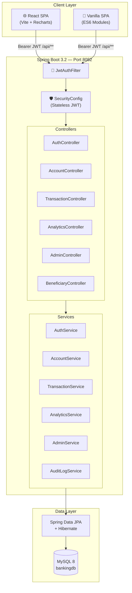

# 🏦 NexBank — Enterprise Banking System


A production-quality, full-stack banking platform built with **Spring Boot 3** and a **React 18 dashboard**. Features JWT authentication, real-time transaction analytics with Recharts, audit logging, admin controls, and 34 Mockito unit tests with JaCoCo coverage enforcement.

---

## 📐 Architecture



---

## ✨ Features

| Category | Features |
|---|---|
| **Auth** | JWT login & registration, BCrypt password hashing, stateless sessions |
| **Accounts** | Create SAVINGS / CURRENT / FIXED accounts, view balance & history |
| **Transactions** | Deposit, Withdraw, Transfer with full audit trail |
| **Analytics** | 6-month balance trend chart, inflow/outflow bar chart, stat cards |
| **Beneficiaries** | Save & manage recurring transfer contacts |
| **Admin Panel** | Freeze/unfreeze accounts, audit logs, global transaction view |
| **API Docs** | Swagger UI via SpringDoc OpenAPI |
| **Tests** | 34 Mockito unit tests, JaCoCo ≥ 70% line coverage enforced |

---

## 🚀 Quick Start

### Prerequisites

- **Java 17+**
- **Maven 3.8+**
- **MySQL 8** running locally
- **Node 18+** (only for frontend dev; Maven downloads it for builds automatically)

### 1. Clone & Configure

```bash
git clone <your-repo-url>
cd banking-system
```

Edit `src/main/resources/application.properties`:

```properties
spring.datasource.url=jdbc:mysql://localhost:3306/bankingdb?createDatabaseIfNotExist=true
spring.datasource.username=root
spring.datasource.password=YOUR_PASSWORD
```

### 2. Build Everything (Backend + React)

```bash
mvn clean install
```

This single command will:
1. Download Node 18 + npm 9 via `frontend-maven-plugin`
2. Run `npm install` in `frontend/`
3. Build the React app → copies to `src/main/resources/static/react/`
4. Compile the Java backend
5. Run all 34 unit tests
6. Verify JaCoCo ≥ 70% line coverage
7. Package the fat JAR

### 3. Run

```bash
mvn spring-boot:run
```

| URL | Description |
|---|---|
| `http://localhost:8082/react/` | ✨ React Dashboard (login here) |
| `http://localhost:8082/` | Vanilla SPA (classic interface) |
| `http://localhost:8082/swagger-ui.html` | Interactive API Documentation |

---

## ⚛️ React Frontend Development

For hot-reload development against the running backend:

```bash
cd frontend
npm install
npm run dev      # starts Vite dev server at http://localhost:5173
```

The Vite dev server proxies all `/api/**` requests to `http://localhost:8082`, so you don't need to configure CORS manually.

```
frontend/
├─ src/
│  ├─ api/          api.js — Axios instance + all endpoint helpers
│  ├─ components/   Sidebar, Topbar, Toast
│  ├─ pages/        Login, Register, Dashboard, Accounts, Transactions,
│  │                Beneficiaries, AdminDashboard
│  ├─ App.jsx       Router + session state
│  └─ index.css     Full design system (dark theme, Recharts overrides)
├─ vite.config.js   build → /static/react/, proxy → :8082
└─ package.json
```

---

## 🔑 Promoting a User to Admin

All registrations default to `CUSTOMER` role. To unlock the Admin panel:

```sql
-- Run in MySQL after registering
UPDATE users SET role = 'ADMIN' WHERE email = 'admin@nexbank.com';
```

Log out and log back in — the Admin panel navigation appears automatically.

---

## 🧪 Tests & Coverage

```bash
# Run tests + generate HTML coverage report
mvn test

# Open the report
start target/site/jacoco/index.html
```

**Test breakdown (34 tests, 0 failures):**

| Test Class | Tests | What's Covered |
|---|---|---|
| `AuthServiceTest` | 4 | Register success/duplicate, Login success/wrong-password |
| `AccountServiceTest` | 6 | Create, list, get own, get unauthorized, user-not-found |
| `TransactionServiceTest` | 14 | Deposit/Withdraw/Transfer — success, frozen, insufficient, unauthorized |
| `BeneficiaryServiceTest` | 6 | Add, list, delete-owner, delete-non-owner, not-found |
| `AnalyticsServiceTest` | 4 | Summary totals, zero-transaction edge case, 6-month arrays |

JaCoCo is configured to **fail the build** if `com.banking.service` line coverage drops below **70%**.

---

## 🛠️ Technology Stack

### Backend
| Technology | Purpose |
|---|---|
| Java 17 | Language |
| Spring Boot 3.2.0 | Application framework |
| Spring Security + JWT (jjwt 0.11.5) | Stateless auth |
| Spring Data JPA + Hibernate 6 | ORM / database access |
| MySQL 8 (prod) / H2 (test) | Persistence |
| SpringDoc OpenAPI 2.3 | Swagger UI docs |
| Lombok | Boilerplate reduction |
| JUnit 5 + Mockito | Unit testing |
| JaCoCo 0.8.11 | Coverage reporting & enforcement |

### Frontend
| Technology | Purpose |
|---|---|
| React 18 + Vite 5 | UI framework + build tool |
| React Router 6 | Client-side SPA routing |
| Recharts 2 | Bar chart, Area chart analytics |
| Axios | API client with JWT interceptor |
| Vanilla CSS | Premium dark theme design system |
| frontend-maven-plugin 1.15 | Builds React inside `mvn package` |

---

## 📡 API Reference

All endpoints (except auth) require `Authorization: Bearer <token>`.

### Auth
| Method | Endpoint | Description |
|---|---|---|
| `POST` | `/api/auth/register` | Register new user |
| `POST` | `/api/auth/login` | Login → JWT token |

### Accounts
| Method | Endpoint | Description |
|---|---|---|
| `GET` | `/api/accounts` | List my accounts |
| `GET` | `/api/accounts/{accountNumber}` | Get single account |
| `POST` | `/api/accounts` | Open new account |

### Transactions
| Method | Endpoint | Description |
|---|---|---|
| `POST` | `/api/transactions/deposit` | Deposit funds |
| `POST` | `/api/transactions/withdraw` | Withdraw funds |
| `POST` | `/api/transactions/transfer` | Transfer between accounts |
| `GET` | `/api/transactions/history/{accountNumber}` | Transaction history |

### Analytics
| Method | Endpoint | Description |
|---|---|---|
| `GET` | `/api/analytics/summary` | 6-month totals + balance history |

### Beneficiaries
| Method | Endpoint | Description |
|---|---|---|
| `GET` | `/api/beneficiaries` | List my beneficiaries |
| `POST` | `/api/beneficiaries` | Add beneficiary |
| `DELETE` | `/api/beneficiaries/{id}` | Delete beneficiary |

### Admin (ADMIN role only)
| Method | Endpoint | Description |
|---|---|---|
| `GET` | `/api/admin/dashboard` | System-wide statistics |
| `GET` | `/api/admin/users` | All registered users |
| `GET` | `/api/admin/transactions` | All transactions |
| `GET` | `/api/admin/audit-logs` | Full audit trail |
| `PUT` | `/api/admin/accounts/{accountNumber}/freeze` | Freeze account |
| `PUT` | `/api/admin/accounts/{accountNumber}/unfreeze` | Unfreeze account |

---

## 🚢 Deploy to Railway

The project ships with a pre-configured [`railway.json`](railway.json).

1. Push to GitHub
2. Create a new Railway project → **"Deploy from GitHub repo"**
3. Add a **MySQL** plugin — Railway injects `DATABASE_URL`, `MYSQL_USER`, `MYSQL_PASSWORD` automatically
4. Set environment variables:
   ```
   JWT_SECRET=<your-256-bit-hex-secret>
   ALLOWED_ORIGINS=https://your-app.railway.app
   ```
5. Railway runs `mvn clean install` (builds React + backend) and starts the JAR

Your app is live at `https://<app-name>.railway.app/react/` 🎉

---

## 📁 Project Structure

```
banking-system/
├─ frontend/                     ← React 18 SPA (Vite)
│  ├─ src/
│  │  ├─ api/api.js              Axios + all API helpers
│  │  ├─ components/             Sidebar, Topbar, Toast
│  │  └─ pages/                  Dashboard, Accounts, Transactions...
│  └─ vite.config.js
│
├─ src/main/java/com/banking/
│  ├─ controller/                REST endpoints (8 controllers)
│  ├─ service/                   Business logic (6 services)
│  ├─ repository/                Spring Data JPA repos
│  ├─ entity/                    JPA entities (User, Account, Transaction...)
│  ├─ dto/                       Request/Response DTOs
│  ├─ security/                  JWT filter, config, entry point
│  └─ exception/                 Custom exception classes
│
├─ src/main/resources/
│  ├─ static/                    Vanilla SPA + built React assets
│  └─ application.properties
│
├─ src/test/java/com/banking/
│  └─ service/                   34 Mockito unit tests
│
├─ pom.xml                       Maven build (JaCoCo + frontend-maven-plugin)
├─ Dockerfile                    Docker support
├─ docker-compose.yml            Local MySQL + app stack
└─ railway.json                  Railway deployment config
```

---

## 🐳 Docker (Optional)

```bash
docker-compose up --build
```

Starts MySQL + the Spring Boot application in isolated containers.

---

*Built with ❤️ using Spring Boot 3, React 18, and 34 passing tests.*
